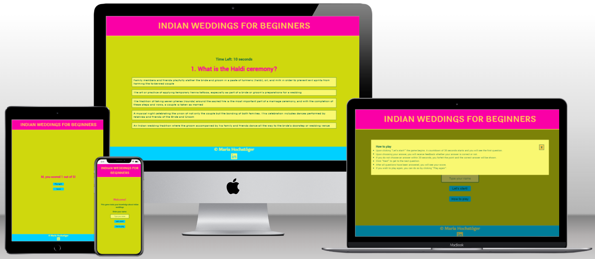
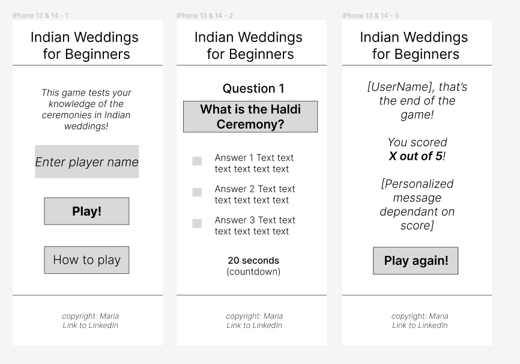
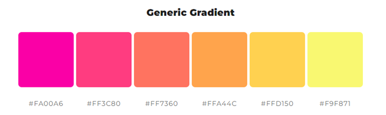
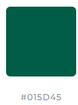
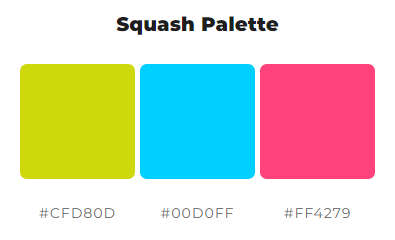
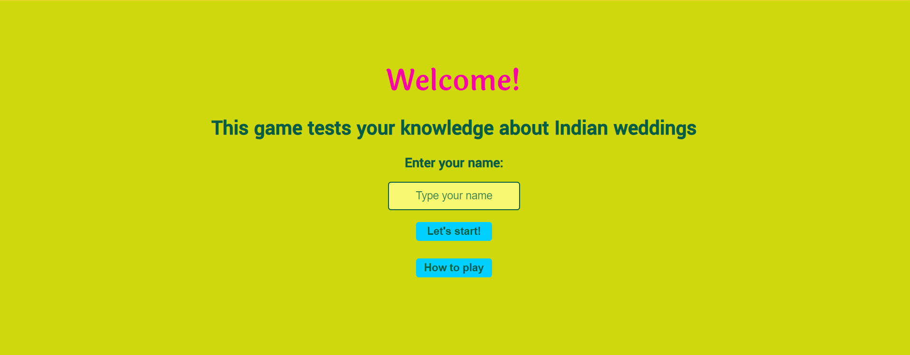
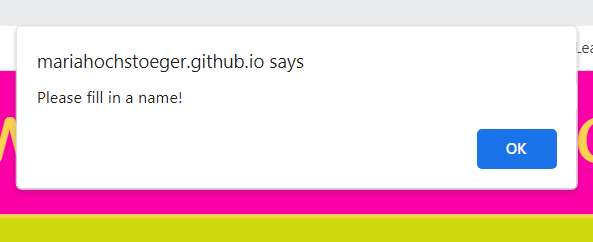
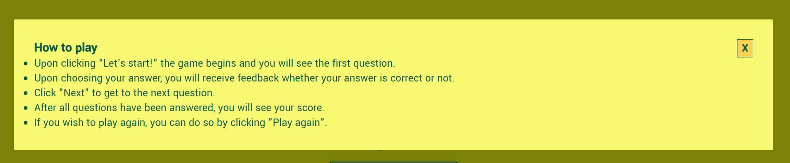
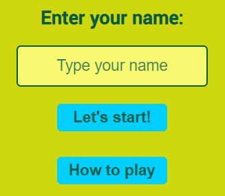

# Indian Weddings for Beginners - A Quiz

Visit the live site [here](https://mariahochstoeger.github.io/project2/).

This is a quiz about Indian weddings. It lets the user test their knowledge about some of the most common events - usually called "functions" - found in a traditional Indian Hindu wedding. On the website and in this readme, the terms "Hindu wedding" and "Indian wedding" are used interchangeably.

## Table of Contents

1. [Design](#design)
2. [Features](#features)
3. [UX](#ux)
4. [Testing](#testing)
5. [Sources](#sources)
6. [Credits](#credits)

## Design

The site was created with persons in mind who have not had any point of contact with traditional Indian weddings so far. The aim was to evoke feelings of joy and celebration, and a distant association to India, through colors and fonts. Besides that, the design is kept very simple and minimal as to not distract the user from the quiz and reading and answering the questions.

### Wireframes

The wireframes were made in Figma. A mockup of a mobile screen was chosen since the site was built using the mobile-first approach. The wireframes were kept very simple and the focus was on structure rather than design. The wireframes also include a countdown field which was not implemented in the basic version of the game. It is a possible future feature.

  

### Font and Colour Choices
**Fonts:** 'Laila' was chosen as the font for the header and main headings for its playful design with its slight nod to the Indian letters used for Hindi, Devanagari, through its gentle flares and curles at the end of the letter strokes. 'Poppins' makes up the main part of the site due to it being a quite neutral, easy-to-read but still friendly font.

**Colours:** The colour palette was generated using [mycolor.space](https://mycolor.space/?hex=%23FA00A6&sub=1). The reference colours were picked from the inspiration image (taken from Pexel) which shows a man with his face full of paint powder, which is common during one of the biggest Indian festivals, Holi, also called the Festival of Colors. Although Holi does not have an association with Indian weddings, the color scheme was chosen as these types of colors are often associated with India more broadly. Furthermore, the colors are bright, vivid and fun, which is an association the quiz would like to evoke.

Inspiration image:  
  
 
 

**Images:** No images are displayed on the site itself. As described above, an inspiration image was used to generate the colour palette.

## Features

The site has the basic features of a static website as well as some interactive features written in JavaScript.

- **Header**
    - The header is always visible throughout the game. It contains the title of the quiz.
    - It is static, without any interactive elements. 
    

- **Main section**
    - The main part of the site contains the interactive and changeable elements of the site. 
    - There is a welcome heading and tagline about the quiz. These elements will disappear as the game progresses but are not interactive.
    - Below, the interactive elements are shown: a username input field, a "Let's start"-button, and a "How to play"-button. 
     

- **Username input field and validation**
    - The username input field with the placeholder text "Type your name" invites the user to input their chosen username.
    - The username is a required input.
    - Should the user click "Let's start" without having provided a username, or having provided only spaces, an error message appears prompting the user to "Please fill in a name!". 
     

- **Rules**
    - If the user would like to know the rules of the game, they can click the "How to play" button.
    - A modal with the rules opens.
    - The modal can be used by either clicking the little X in the top right corner of the modal, or clicking anywhere on the page outside the modal 
     

- **Let's Start**
    - If the user feels comfortable to start playing they can click on the "Let's Start" button.
    - Upon clicking the button, the username input gets validated and - if successful - the game starts. 
     

- **Question field**
    - ...

- **Answer buttons**
    -...

- **Final score**
    -...

- **Play again or Home buttons**
    -...

- **Footer**
    - The footer contains a copyright symbol and the author's, ie my, name.
    - There is a LinkedIn icon. The icon opens in a new tab, making it easy for users to come back to the quiz site.
    - The footer is consistent throughout the pages.
    

### Possible Future Features

- Include a timer

    - In the future, a timer could be included in order to make the game more fast-paced and exciting.
    - Upon clicking "Let's Start", or "Next", a timer of e.g. 30 seconds could start running.
    - The timer is reset for each question.
    - If the user answers within the 30 seconds, the timer stops and only starts running again at the next question.
    - If the time has expired without the user giving an answer, the answer buttons would get disabled and the next button would appear.
    - The respective question would be counted as incorrect.

- Include a progress bar

    - In order to show the user how many questions are remaining in the game, a progress bar could be introduced.
    - With each question answered, the progress bar would fill up until it was full after answering the last question.
    - This would give the user a better feeling of how much time the game needs, and motivate users to play until the end.

## UX

### Site Goals

The site wants to motivate users to play the game and by doing so, learn about the main functions of Indian weddings. The site wants to evoke a happy atmosphere and good feelings.
Should the user not get all questions right from the start, the site would like to make sure it does not discourage users from trying again by simply stating the score without judging it good or bad.

### User Stories

**As a site visitor:**

- I want to know what this site offers at a glance.
- I want to see a responsive design which looks good on mobile devices as well as on larger screens.
- I want to be guided through the site by an intuitive design, and not be distracted by unnecessary elements.
- I want to have a positive, joyful experience.
- I want to get feedback on my actions such as inputting a username or answering questions.
- I want to learn about Indian weddings.
- I want to see my final score.
- I want to be able to play again, or let a friend play on the same device after I am finished.

**As the site administrator:**

- I want to be able to adapt the existing questions or add new questions to the game easily.
- I want to be able to add potential future features should I so desire.

## Testing

- I confirmed that this project is responsive and looks good on various common screen sizes by using the devtools devices toolbar.
- I have confirmed that the username input validation works. There is an error message if the field is not filled out correctly.
- I checked that the modal opens upon clicking "How to Play" and can be closed by either clicking the little X, or anywhere on the page outside the modal.
- I made sure that the answer buttons give a correct colour-coded feedback upon selecting and clicking on an answer: red for incorrect, green for correct.
- I ensured that the "Play again" button takes the user to the start of the quiz, while the "Home" button takes the user to the start page.
- I confirmed that header and footer are easily readable and understandable.

### Fixed Bugs

- JavaScript elements not working because of elements with the same class name on different html-pages. Fixed - with the great help of my mentor, Spencer Barriball - by merging the two html-files into one.

### Unfixed Bugs

- None.

### Validator Testing

- HTML ([W3C Validator](https://validator.w3.org/))
    - 1 error found: "Section lacks heading. Consider using h2-h6 elements to add identifying headings to all sections, or else use a div element instead for any cases where no heading is needed."
    - Solution: introduced h4-element to the section and set it to display = none.

- CSS ([Jigsaw](https://jigsaw.w3.org/css-validator/))
    - No error found.

- Performance, Accessibility, Best Practices, SEO (Lighthouse Chrome Dev Tools)
    - Accessibility is at 100, which is what the focus was one.
Performance is mediocre, also after compressing images.
    - 

### Browser Testing (section adapted from Kay Welfare, results are my own)

**Layout:** Testing layout and appearance of site for consistency throughout browsers.

**Functionality:** Ensuring all links, navigation and form submit functions as expected throughout browsers.

| Browser     | Layout      | Functionality |
| :---------: | :----------:| :-----------: |
| Chrome      | ✔          | ✔             |
| Edge        | ✔          | ✔             |
| Firefox     | ✔          | ✔             |
| Safari*     | only available to me on iPhone |
| IE          |deprecated by Microsoft, not tested|

*I asked my peers to review the site for me in Safari and one colleague came back with no bugs found (he made suggestions on styling which I did not implement since I considered them personal preference).

### Manual Testing (section adapted from Kay Welfare, results are my own)

| Feature     | Expect      | Action        | Result |
| :---------: | :----------:| :-----------: | :-----:|
| **Logo Icon**   | When clicked, home page will open   | Clicked Logo Icon  | Home page opened when clicked |
| **Navbar Buttons**  | When clicked, the respective page will open  | Clicked all individual navbar buttons | All respective pages opened when button was clicked |
| **Book A Session Now! Button** | When clicked, Contact page will open  | Clicked on the Book A Session Now! Button | Contact page opens |
| **Email link on contact page** | When clicked, a blank email will open with the email address as the recipient | Click email link | New blank email opens with email address as recipient |
| **Social link icons** | Social link icons open relevant websites in new tab when clicked | Click all individual icons | All respective sites open in new tab |
| **Form submit button** | Form submits when submit button is clicked | Fill out form and click submit button | CI form dump page opens and displays form contents |
| **Required form fields** | Form will not submit if required fields are blank and/or filled incorrectly, and fields will be highlighted and flagged | Fill out form incorrectly | Form does not submit and highlights incorrectly filled-in fields and gives prompts what may be wrong (eg @-sign missing in email address field) |

### Testing User Stories (section adapted from Kay Welfare, results are my own)

| Expectation                         | Result                          |
| :---------------------------------: | :------------------------------:|
| I want to confirm that Dr. Giri is a qualified psychotherapist | As a visitor, I can see that Dr. Giri is a psychotherapist on the home page, his full title is visible on the contact page |
| I want to know which languages Dr. Giri speaks | As a visitor, I can find the languages which Dr. Giri offers sessions in on the about page |
| I want to learn about the types of sessions Dr. Giri offers | As a visitor, I can find the types of sessions which Dr. Giri offers on the about page |
| I want to know how much a session costs | As a visitor, I can find the costs of the various types of sessions on the about page |
| I want to find out whether Dr. Giri specializes in the field which I struggle with | As a visitor, I can find the fields Dr. Giri specializes in on the about page |
| I want to see where Dr. Giri is located | As a visitor, I can find Dr. Giri's practice's address on the contact page |
| I want to be able to get in contact with Dr. Giri in the manner that I choose to. | As a visitor, I can choose to get in contact with Dr. Giri in the manner I prefer, whether this is to send an email, or call, or have Dr. Giri contact me |
| I want to see a mobile friendly layout and responsive design | As a visitor, I have a good view of the site on mobile device without overflow or side-scrolling |

## Deployment

This site was deployed on GitHub Pages:
- From the repository, first navigate to "Settings" (top of the page) and then "Pages" (left of the newly opened page)
- Under "Source" choose "Deploy from a Branch" in the dropdown menu
- Choose the "main" Branch, and folder "/(root)"
- Click "save"
- The website is subsequently deployed (this may take a few minutes) on GitHub Pages
- To get there, in the "Code" tab of the repository, on the right-hand side under "Environments" click on "github-pages"
- On the newly opened page, on the right-hand side, click on "View deployment"

## Sources

- Love Running walk-through project for basic structures of header and footer
- Favicon: <a target="_blank" href="https://icons8.com/icon/ZFiK6ATniCG5/heart">Heart</a> icon by <a target="_blank" href="https://icons8.com">Icons8</a>
- The mock-up image of the site on different devices was generated using [techsini.com](https://techsini.com/multi-mockup/)
- All images taken from pexels.com
- Images were compressed using [iloveimg.com](https://www.iloveimg.com/)

## Credits
- Modal: https://www.w3schools.com/howto/howto_css_modals.asp
- Quiz: Tutorial from https://www.youtube.com/watch?v=PBcqGxrr9g8&t=118s 
- How to make the inspiration image in this readme.md file smaller: https://stackoverflow.com/questions/14675913/changing-image-size-in-markdown
- Definition of Mehndi: Oxford Languages
- Definition of Baraat: https://getethnic.com/blogs/baraat/
- Definition of Sangeet: https://events.restless.co.uk/event-calendar/sangeet-night/
- Definition of Haldi: https://www.ruraltreasures.com/blogs/news/the-traditional-significance-of-haldi-ceremony
- Show the top of the screen after clicking next: https://www.w3schools.com/jsref/met_win_scrollto.asp